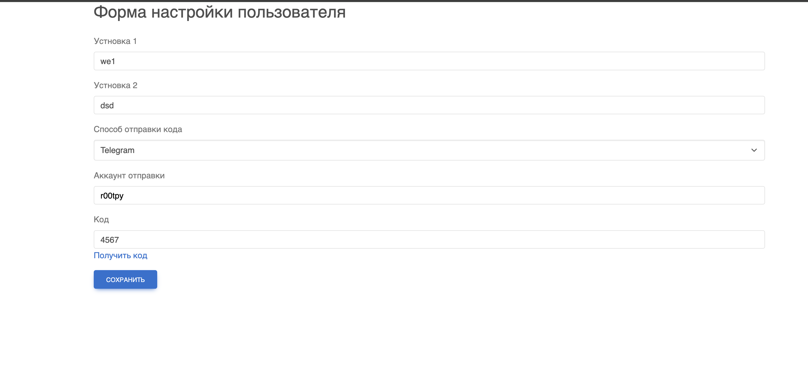

### Install
```
docker-compose build
docker-compose up -d
sh shell.sh
php artisan key:generate
php artisan migrate
```

### API
```
http://localhost/api/user/updateOrCreate/setting/{user_id} - POST - создать или обновить настройки пользователя
http://localhost/api/user/send/notification - POST - отправить  код уведомление пользователю
```

### Screenshots
После установки и запуска проекта, можно перейти по адресу http://localhost/ отправить запрос на создание или обновление настроек пользователя, а также отправить уведомление код пользователю.
Без корректного ключа приложения, запрос на создание или обновление настроек пользователя не будет выполнен.


### Данные от пользователя
```
{
    "user_id": 1,
    "key1": "value1",
    "key2": "value2",
    "code": "1234"
    
}
```
### Данные код уведомления
```
{
    "user_id": 1,
    "method": "sms" # ['telegram', 'sms', 'email']
    "method-address": "@username" # ['+79999999999', 'example@gmail.com']
}
```

